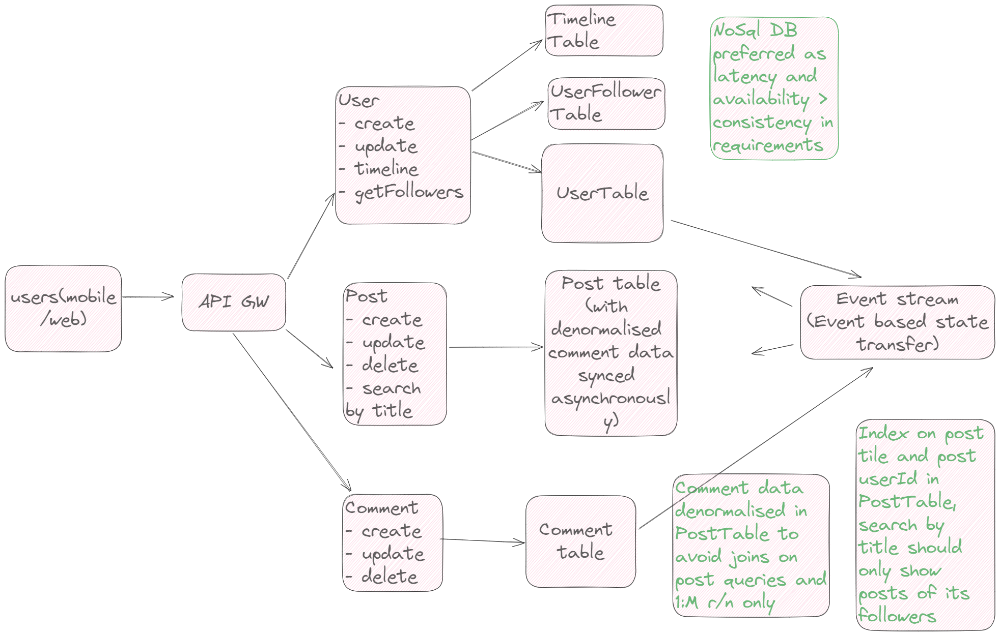

# grokking + self hybrid design + requirements

grokking - https://www.designgurus.io/course-play/grokking-the-system-design-interview/doc/638c0b61ac93e7ae59a1afbd

Step1: requirements gathering -

Step2: Capacity estimation (skipped)

Step3: Entities involved + r/n between them

Step4: HLD with tradeoffs
