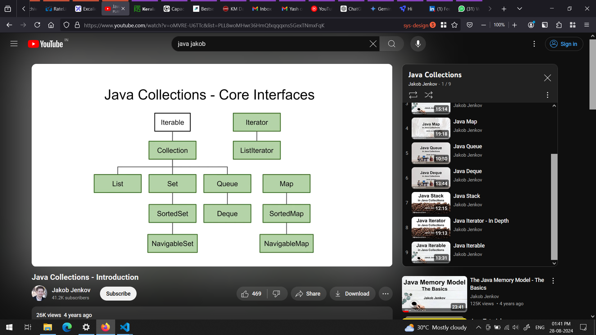

Best resource:
https://jenkov.com/tutorials/java-collections

Collection summary: 

Tips:

1. If you are writing some code that needs to iterate a collection lots of times in a tight loop, let's say iterate a Java List thousands of times per second, iterating the List via the Java for-each loop is slower than iterating the list via a standard for-loop as seen here: () 

